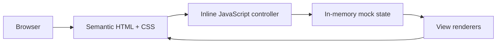

# System Design — Pulse

## 1. Purpose and Scope

Pulse is a browser-based dashboard for sharing files and clipboard content between trusted devices on the same local network. The audience is a person managing a small household or team network; the single job is deciding quickly what enters, leaves, or waits for approval. The current repository is a clickable front-end prototype: it demonstrates the user experience and state transitions, but it does not transfer data or connect to a real network.

## 2. Current Architecture

The application is delivered as one static document, [`10-pulse-resumo.html`](./10-pulse-resumo.html):

- **Presentation:** semantic HTML, CSS custom properties, responsive layouts, and accessible labels.
- **Controller:** inline JavaScript handles navigation, device selection, approvals, pause/resume actions, Clipboard actions, and toast feedback.
- **State:** `views`, `deviceData`, and `clipboardData` are plain in-memory objects. Reloading the page resets all state.
- **Runtime:** no package manager, framework, backend, persistence layer, or external assets are required.

## 3. Visual Design System

The visual language is a quiet local-network workspace: warm paper surfaces, dark ink, cool network signals, and one clear action color. The hero thesis is **“the local network is in motion”**: current network state leads, while the greeting and explanatory copy remain secondary. New UI must reuse these tokens instead of adding arbitrary colors.

### Color Tokens

| Role | Token | Value | Usage |
| --- | --- | --- | --- |
| Outer canvas | — | `#d7d2ca` | Browser background around the app |
| App surface | `--bg` | `#f2eee7` | Main workspace background |
| Paper surface | `--paper` | `#fbfaf7` | Footer and raised paper areas |
| Text | `--ink` | `#202b30` | Headings and primary copy |
| Muted text | `--muted` | `#7f8b8d` | Metadata and supporting copy |
| Divider | `--line` | `#d8d7cf` | Rules and low-emphasis borders |
| Network | `--navy`, `--sky` | `#203e50`, `#cde6ed` | Device identity and transfer surfaces |
| Safe/complete | `--green`, `--mint` | `#477e64`, `#d9eadc` | Trusted, received, ready, or approved states |
| Primary action | `--coral` | `#b84435` | Send, links, brand mark, and attention affordances |
| Attention | `--yellow`, `--yellow-ink` | `#f6df9d`, `#886728` | Pending requests and sensitive-code context |

The approval action uses `--green`; coral is not used to imply a destructive approval. Progress uses the cool teal accents already defined in the stylesheet (`#65aebe` and `#4c8793`).

### Typography

- **Family:** `Inter, ui-sans-serif, system-ui, -apple-system, "Segoe UI", sans-serif`; do not add a remote font dependency for this prototype.
- **Display:** page titles use 29px, weight 650, line-height 1.04, and tight tracking (`-.065em`).
- **Section labels:** 12px uppercase with `.12em` tracking; labels describe real content, not decoration.
- **Body and controls:** 14px body text; controls and supporting copy range from 11–13px. Mobile summary metadata must remain at least 11px.
- **Sensitive values:** use `ui-monospace, SFMono-Regular, Menlo, monospace` for codes only.
- **Copy:** user-facing text stays in Brazilian Portuguese, uses sentence case, active verbs, and names the action the person controls.

### Type Roles and Signature

- **Display role:** `--font-display` (`Avenir Next`, `Trebuchet MS`, `ui-rounded`) for the hero and page titles. It is intentionally more personable than the body face while remaining system-local.
- **Body role:** `--font-body` keeps dense status and explanatory copy quiet and legible.
- **Utility role:** `--font-utility` is reserved for sensitive codes and technical values; never use it for normal prose.
- **Signature element:** the open coral orbit with a green online node in the hero represents a local pulse: one connected network with activity moving through it. Keep this motif in the hero/brand zone only; do not repeat it as decoration in every card.

### Layout, Shape, and Interaction Rules

- Desktop workspace: max 1180px wide, with a 76px header, 20px/32px main padding, and a `1fr + 329px` summary split.
- At 940px, summary content becomes one column and Clipboard side content collapses. At 700px, metrics become a 2×2 grid, device directories become horizontal, and the shell uses 12px radius.
- Use 6–12px control/card radii; reserve the 17px radius for the outer app shell. Dividers are 1px; major section rules are 2px.
- Hover and active states use the warm selection surface (`#e7e3db`). Keyboard focus always uses a 3px `#83b8c5` outline with offset.
- Motion stays subtle (roughly `.15–.2s`) and should be disabled or shortened under `prefers-reduced-motion`.

### State Rules

| State | Visual treatment | Copy behavior |
| --- | --- | --- |
| Trusted/ready | `--green` with `--mint` or a green status mark | Say what is ready or trusted |
| In progress | `--accent-teal` on `--surface-transfer` with a measurable progress value | Include destination and amount transferred |
| Needs attention | `--yellow`/`--yellow-ink` on `--surface-attention` | Name the decision and its source |
| Destructive/refused | Keep secondary and neutral; never use the approval green | Say exactly what was refused or removed |
| Empty | Quiet surface with a clear next action | Explain what the person can do next |
| Error/offline | Add an explicit error or offline state; do not rely on color alone | State what failed and how to recover |

Every state must have text in addition to color, a visible keyboard focus treatment, and a touch target large enough for mobile use. Add loading and offline variants before connecting real devices.

## 4. Views and Responsibilities

- **Resumo:** shows pending approvals, active transfers, recent activity, online devices, and privacy guidance.
- **Dispositivos:** selects a device and exposes Overview and Clipboard subviews.
- **Histórico:** presents recent transfer events.
- **Clipboard:** composes text, links, and local image previews; sensitive codes remain masked until explicitly revealed.

## 5. Key Flows

Navigation updates the visible `pulse-view` and document title. Device selection calls `renderDevice`, which updates device metadata, transfer state, history, and Clipboard contents. Approval or rejection removes a pending request and updates summary counts. Clipboard sends prepend an item and retain the six newest entries. File selection currently reports a prepared item but does not upload it.

## 6. Security and Production Boundaries

The mock data is safe for local demonstration only. A production implementation needs authenticated device pairing, encrypted local transport, explicit authorization per transfer, file-size/type limits, bounded Clipboard retention, and server-side validation. Never place credentials or private network data in this static file. Revoke generated object URLs after image previews are no longer needed.

## 7. Evolution Plan

If the prototype becomes a product, split the document into view components, a state store, and a transport adapter. Keep the UI independent from discovery and transfer protocols so WebSocket, WebRTC, or another local transport can be tested separately. Add automated tests for state transitions and end-to-end tests for navigation, approvals, transfers, Clipboard masking, and responsive behavior.
