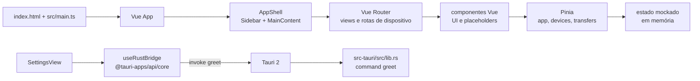
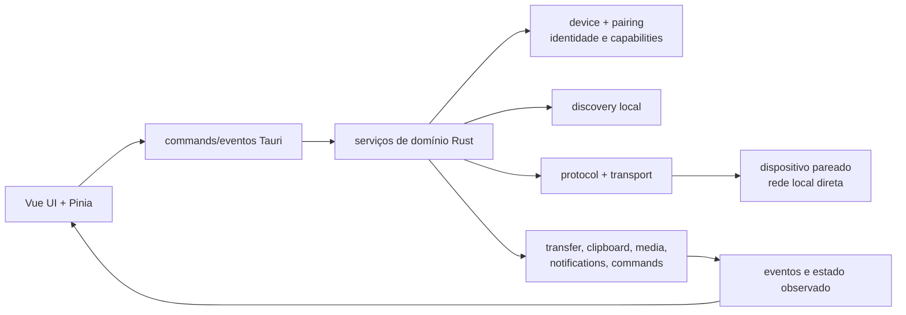

# Pulse — System Design

Este é o documento principal da arquitetura do Pulse. A primeira parte descreve o que está implementado; as seções de direção futura descrevem contratos e módulos planejados, sem tratá-los como código existente. Produto e roadmap funcional ficam no [PRODUCT.md](PRODUCT.md); UI/UX fica no [DESIGN.md](DESIGN.md).

## Resumo do estado atual

O repositório contém uma fundação desktop Tauri 2 com frontend Vue 3. O frontend tem navegação, componentes e stores com dados mockados. A comunicação nativa é um único command Rust (`greet`) usado para validar a bridge. Discovery, pairing, rede, persistência, transferência real e os serviços de integração ainda não existem.

### Legenda de maturidade

- **Implementado:** comportamento presente e executável no código atual.
- **Estruturado:** rota, tipo, store, diretório ou contrato visual preparado, mas sem comportamento de produto completo.
- **Planejado:** direção definida para implementação futura.
- **Futuro:** possibilidade posterior, ainda dependente de decisões técnicas ou de segurança.

## Stack e configurações de referência

- **Desktop/runtime:** Tauri 2, Rust 2021 e `@tauri-apps/api`.
- **Frontend:** Vue 3, TypeScript estrito, Vite e Vue Router.
- **Estilos e componentes:** Tailwind CSS v4 via `@tailwindcss/vite`, tokens em `src/styles/index.css` e componentes no estilo shadcn-vue conforme `components.json` (`new-york`, aliases `@/*`).
- **Estado e utilitários:** Pinia, VueUse, `clsx`, `tailwind-merge` e `class-variance-authority`.
- **Iconografia:** Lucide para interface e Simple Icons para marcas/plataformas.
- **Resolução de imports:** alias `@` aponta para `src/` em `vite.config.ts` e `tsconfig.json`.
- **Servidor Vite:** porta `1420`, com `strictPort: true`.

## Arquitetura implementada



### Frontend

- `src/main.ts` cria o app Vue, instala Pinia e Vue Router e importa os estilos globais.
- `src/App.vue` delega para `AppShell.vue`.
- `src/components/app/` contém o shell persistente: sidebar e cabeçalho/conteúdo.
- `src/views/` contém as páginas de Início, Transferências, Histórico, Configurações e contexto de dispositivo.
- `src/components/device/`, `media/` e `transfer/` contêm composições de dados demonstrativos e placeholders.
- `src/components/ui/` contém os componentes reutilizáveis mínimos `Button`, `Badge` e `BrandMark`.
- `src/styles/index.css` importa Tailwind CSS v4, define tokens Pulse e os breakpoints do shell.

### Rotas

O router usa `createWebHistory()` e define:

| Rota | Estado |
| --- | --- |
| `/` | `HomeView`, implementado como fundação/mock |
| `/transfers` | `TransfersView`, estrutura inicial |
| `/history` | `HistoryView`, estado vazio sem persistência |
| `/device/:id` | `DeviceView`, contexto por dispositivo |
| `/device/:id/overview` | rota preparada |
| `/device/:id/files` | rota preparada |
| `/device/:id/clipboard` | rota preparada |
| `/device/:id/media` | rota preparada com placeholder específico |
| `/device/:id/control` | rota preparada |
| `/settings` | teste da bridge e dados da base |

### Estado atual

Pinia tem três stores, todos efêmeros e inicializados com dados locais:

- `app`: versão `0.1.0`, estado da bridge e chamada `testBridge()`.
- `devices`: três dispositivos mockados, `selectedDeviceId`, dispositivo selecionado, lista online e `selectDevice()`.
- `transfers`: dois registros mockados; `activeTransfers` exclui somente itens com status `complete`.

Não há persistência, hidratação, sincronização com rota/eventos, mutation de transferências, histórico ou fonte nativa de dispositivos. Recarregar a aplicação reinicia os stores.

### Bridge Tauri ↔ Rust

`useRustBridge()` detecta `window.__TAURI_INTERNALS__`:

- no navegador, retorna uma mensagem de prévia web marcada como demo;
- no Tauri, chama `invoke<string>("greet", { name })`;
- `SettingsView` expõe esse teste e mostra `idle`, `loading`, `success` ou `error`.

Em Rust, `src-tauri/src/lib.rs` registra apenas:

```rust
#[tauri::command]
fn greet(name: &str) -> String
```

Não há comandos de domínio, eventos, listeners, sockets, processos auxiliares ou serialização de mensagens de produto.

## Shell Tauri e configuração

- Tauri `2.8.0` no runtime e CLI `2.11.4` no projeto.
- Entrada Rust em `src-tauri/src/main.rs`, delegando para `pulse_lib::run()`.
- `beforeDevCommand`: `npm run dev`; `devUrl`: `http://localhost:1420`.
- `beforeBuildCommand`: `npm run build`; `frontendDist`: `../dist`.
- Janela `main`: `1280 × 800`, mínimo `960 × 640`, redimensionável e não fullscreen.
- `withGlobalTauri` é `false`.
- `src-tauri/capabilities/default.json` concede somente `core:default`; não há capabilities para rede, arquivos, notificações ou controle.
- `csp` está `null` na configuração atual; isso é uma condição da fundação e deve ser revisada antes de distribuição.
- `bundle.active` está `false`; o shell é executável em desenvolvimento, mas o empacotamento não está habilitado como entrega atual.

## Módulos preparados no Rust

Os diretórios abaixo existem com `.gitkeep`, mas não têm implementação. Eles são pontos de organização, não módulos ativos:

`src-tauri/src/domain/` é a exceção: contém somente modelos puros e transições do domínio, ainda sem commands, eventos IPC ou serviços ativos.

| Módulo | Responsabilidade planejada |
| --- | --- |
| `discovery/` | Encontrar e acompanhar presença de dispositivos na rede local. |
| `pairing/` | Pareamento explícito, identidade, confiança e revogação. |
| `device/` | Registro, metadados e estado dos dispositivos conhecidos. |
| `protocol/` | Contratos de mensagens, capacidades e transporte entre peers. |
| `transfer/` | Sessões de arquivos/pastas, fila, progresso, pausa e retomada. |
| `clipboard/` | Conteúdo de Clipboard e sincronização/envio autorizado. |
| `media/` | Estado e controle de mídia sob capability específica. |

## Direção arquitetural planejada



### Limite de camadas

1. **UI Vue:** apresenta estado, solicita intenções e não conhece detalhes de sockets, criptografia ou formato de pacotes.
2. **Bridge Tauri:** expõe comandos e eventos mínimos, validando entrada e capability antes de encaminhar.
3. **Domínio Rust:** coordena dispositivos, confiança, sessões e efeitos locais.
4. **Discovery/transport/protocol:** descobre peers e move mensagens diretamente pela rede local.
5. **Serviços de recurso:** implementam transferências, Clipboard, mídia, notificações e comandos sob autorização.

A UI deve depender de modelos de domínio estáveis e eventos, não de uma implementação específica de transporte. A TASK 02 registra a decisão arquitetural de usar mDNS/DNS-SD para discovery e QUIC v1 para o transporte direto; essa decisão ainda não está implementada no código atual.

## Modelo de capabilities — direção

Capabilities continuam sendo uma proposta de autorização operacional por dispositivo, embora o vocabulário canônico já esteja modelado em TypeScript e Rust. A intenção é separar “o dispositivo está pareado” de “este recurso pode ser usado”. Exemplos iniciais:

| Capability | Escopo pretendido |
| --- | --- |
| `files.send` / `files.receive` | Enviar ou receber arquivos e pastas |
| `clipboard.read` / `clipboard.write` | Ler ou escrever Clipboard remoto |
| `text.send` / `links.send` | Compartilhar conteúdo leve |
| `media.read` / `media.control` | Observar ou controlar mídia |
| `notifications.receive` | Receber avisos locais |
| `commands.execute` | Executar comandos previamente autorizados |

Cada capability deve ter, no mínimo, identidade do dispositivo, estado (`available`, `requested`, `granted`, `denied` ou `revoked`), direção quando aplicável e registro da decisão. A política de segurança, identidade, pairing, revogação, defaults e matriz de capabilities está definida em [`docs/tasks/TASK-03-threat-model-identidade-trust-capabilities.md`](docs/tasks/TASK-03-threat-model-identidade-trust-capabilities.md); persistência e UX de aprovação continuam pertencendo às tasks próprias.

## Direção por domínio

### Discovery e pairing — planejado

Discovery deve localizar candidatos na rede local e expor presença sem conceder acesso. Pairing deve exigir ação explícita, apresentar identidade verificável e criar uma relação confiável revogável. Nenhum desses fluxos existe hoje.

### Transfer — planejado

O serviço deve tratar arquivos e pastas como sessões observáveis, com origem, destino, estado, progresso, erro e cancelamento. Pausa/retomada, limites de tamanho/tipo, colisões de nome e retomada após falha precisam de decisões próprias. O `MockTransfer` atual continua sendo apenas um fixture visual; o `TransferSession` canônico ainda não está conectado a um serviço.

### Clipboard, texto e links — planejado

Começar por conteúdo textual e links, com envio explícito e políticas de retenção local. Leitura/escrita automática e sincronização contínua só devem existir depois de uma capability correspondente. Hoje a aba existe apenas como rota.

### Mídia, controle e comandos — futuro planejado

São integrações de maior impacto e dependem de capabilities específicas, confirmação, escopo limitado e registro de execução. O repositório só possui a rota e, para Mídia, um placeholder.

### Notificações e histórico — planejado

Notificações devem ser efeitos locais derivados de eventos de domínio. Histórico deve persistir eventos relevantes, incluindo decisões de confiança e resultados, sem confundir log técnico com conteúdo sensível. Não há armazenamento nem eventos hoje.

## Segurança e limites de produção

A direção é local e sem cloud, mas local não significa automaticamente confiável. A política de autenticação de peers, pareamento seguro, autorização por capability, armazenamento de identidade, anti-replay, limites de comandos e revogação está definida na TASK 03; a implementação de transporte criptografado, validação de payloads, limites de arquivos, retenção de Clipboard e tratamento de caminhos continua futura. Não declarar “criptografia ativa”, “dispositivo confiável” ou “transferência concluída” enquanto essas camadas não existirem.

Não adicionar credenciais, dados privados de rede ou lógica de transferência de produção ao mock atual. Capabilities Tauri extras só devem ser adicionadas junto do recurso que as exige e com o menor escopo possível.

## Sequência técnica sugerida

1. Definir modelos de domínio e eventos sem acoplamento à UI.
2. Implementar discovery e ciclo de vida do dispositivo.
3. Implementar pairing/trust e o modelo de capabilities.
4. Isolar e testar o transporte/protocolo local.
5. Conectar transferências e conteúdo leve à bridge.
6. Adicionar persistência, histórico, notificações e integrações avançadas.

Cada etapa deve manter um modo mockado honesto para desenvolvimento visual e adicionar testes de estado antes de conectar efeitos reais.
