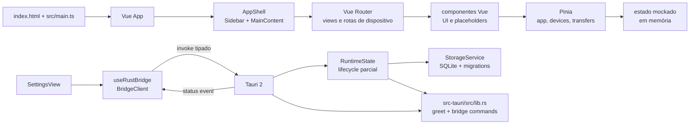
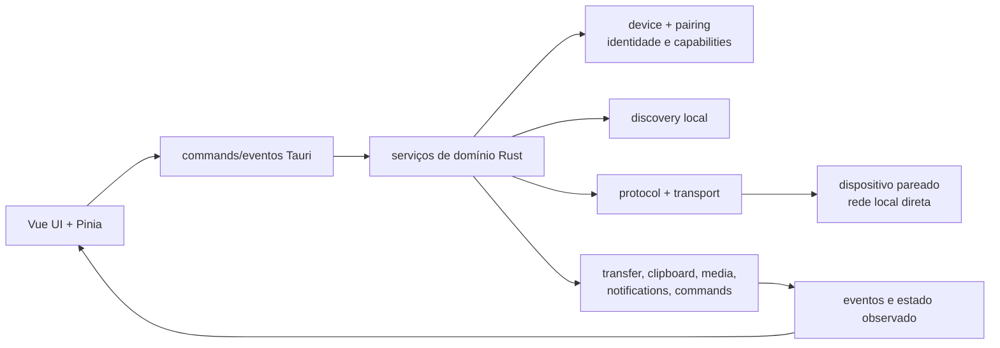

# Pulse — System Design

Este é o documento principal da arquitetura do Pulse. A primeira parte descreve o que está implementado; as seções de direção futura descrevem contratos e módulos planejados, sem tratá-los como código existente. Produto e roadmap funcional ficam no [PRODUCT.md](PRODUCT.md); UI/UX fica no [DESIGN.md](DESIGN.md).

## Resumo do estado atual

O repositório contém uma fundação desktop Tauri 2 com frontend Vue 3. O frontend tem navegação, componentes e stores com dados mockados. O processo Tauri possui um runtime interno estruturado, registra o serviço de storage SQLite local e expõe a infraestrutura bridge tipada (`bridge_get_info`, `bridge_get_snapshot` e `pulse.bridge.status`), mas os demais serviços de produto permanecem não configurados. Discovery, pairing, rede, hidratação da UI, transferência real e os efeitos locais ainda não existem.

### Legenda de maturidade

- **Implementado:** comportamento presente e executável no código atual.
- **Estruturado:** rota, tipo, store, diretório ou contrato visual preparado, mas sem comportamento de produto completo.
- **Planejado:** direção definida para implementação futura.
- **Futuro:** possibilidade posterior, ainda dependente de decisões técnicas ou de segurança.

## Stack e configurações de referência

- **Desktop/runtime:** Tauri 2, Rust 2021 e `@tauri-apps/api`.
- **Frontend:** Vue 3, TypeScript estrito, Vite e Vue Router.
- **Estilos e componentes:** Tailwind CSS v4 via `@tailwindcss/vite`, tokens em `src/styles/index.css` e componentes no estilo shadcn-vue conforme `components.json` (`new-york`, aliases `@/*`).
- **Estado e utilitários:** Pinia, VueUse, `clsx`, `tailwind-merge` e `class-variance-authority`.
- **Iconografia:** Lucide para interface e Simple Icons para marcas/plataformas.
- **Resolução de imports:** alias `@` aponta para `src/` em `vite.config.ts` e `tsconfig.json`.
- **Servidor Vite:** porta `1420`, com `strictPort: true`.

## Arquitetura implementada

### Frontend

- `src/main.ts` cria o app Vue, instala Pinia e Vue Router e importa os estilos globais.
- `src/App.vue` delega para `AppShell.vue`.
- `src/components/app/` contém o shell persistente: sidebar e cabeçalho/conteúdo.
- `src/views/` contém as páginas de Início, Transferências, Histórico, Configurações e contexto de dispositivo.
- `src/components/device/`, `media/` e `transfer/` contêm composições de dados demonstrativos e placeholders.
- `src/components/ui/` contém os componentes reutilizáveis mínimos `Button`, `Badge` e `BrandMark`.
- `src/styles/index.css` importa Tailwind CSS v4, define tokens Pulse e os breakpoints do shell.

### Rotas

O router usa `createWebHistory()` e define:

| Rota | Estado |
| --- | --- |
| `/` | `HomeView`, implementado como fundação/mock |
| `/transfers` | `TransfersView`, estrutura inicial |
| `/history` | `HistoryView`, estado vazio sem persistência |
| `/device/:id` | `DeviceView`, contexto por dispositivo |
| `/device/:id/overview` | rota preparada |
| `/device/:id/files` | rota preparada |
| `/device/:id/clipboard` | rota preparada |
| `/device/:id/media` | rota preparada com placeholder específico |
| `/device/:id/control` | rota preparada |
| `/settings` | teste da bridge e dados da base |

### Estado atual

Pinia tem três stores, todos efêmeros e inicializados com dados locais:

- `app`: versão `0.1.0`, estado da bridge e chamada `testBridge()`.
- `devices`: três dispositivos mockados, `selectedDeviceId`, dispositivo selecionado, lista online e `selectDevice()`.
- `transfers`: dois registros mockados; `activeTransfers` exclui somente itens com status `complete`.

O storage Rust persiste schema e metadados por APIs internas, mas ainda não há hidratação dos stores, sincronização com rota/eventos, mutation de transferências, histórico conectado ou fonte nativa de dispositivos. Recarregar a aplicação reinicia os stores Vue.

### Bridge Tauri ↔ Rust — infraestrutura implementada

`useRustBridge()` expõe o `BridgeClient` de `src/bridge/client.ts`, que é a única fronteira TypeScript com `invoke`/`listen`:

- no navegador, `greet` continua marcado como demo e leituras/listeners não chamam Tauri nem simulam sucesso de produto;
- no Tauri, leituras enviam requests `camelCase` com `bridgeContractVersion=1` e `requestId` correlacionado;
- os commands de leitura aceitam somente a webview principal `main`, mantendo a origem de janela fora do payload público;
- respostas, erros e eventos são validados no adapter; IDs, versões, sequência e dados públicos não são aceitos implicitamente;
- listeners são compartilhados, deduplicam `eventId`, detectam gaps/troca de stream e aguardam a Promise de `listen` antes de `unlisten`.

Em Rust, `src-tauri/src/bridge/mod.rs` registra DTOs fechados e redigidos para `bridge_get_info` e `bridge_get_snapshot`, além do evento `pulse.bridge.status` emitido depois do start do runtime. O snapshot reporta `offline` e `not-configured` enquanto não há serviço de produto. `greet` permanece sem envelope como smoke test legado; `SettingsView` continua mostrando seus estados locais `idle`, `loading`, `success` e `error`.

O runtime em `src-tauri/src/runtime/mod.rs` é um orquestrador puro e testável: mantém slots `not-configured`, `inactive`, `stopped`, `running` e `failed`, inicia serviços configurados em ordem fixa, faz cleanup reverso e retorna erros fechados. No `setup`, `StorageService` abre `app_local_data_dir()` e aplica o schema SQLite; os demais serviços permanecem não configurados, então o runtime continua em `partial` e não alega que networking ou recursos estão ativos.

Ainda não há comandos de domínio, sockets, processos auxiliares, serialização de mensagens de produto ou serviços de recursos registrados. A bridge implementada é somente infraestrutura de contrato; o storage continua interno e os stores Vue não são hidratados por ela.

### Contrato da bridge — infraestrutura implementada

A TASK 05 definiu e a TASK 09 implementou o subconjunto IPC seguro: `bridgeContractVersion=1`, `DOMAIN_MODEL_VERSION=1`, requests correlacionados por `requestId`, respostas `success/stale/offline`, erros com códigos e `messageKey`, e os eventos namespaced `pulse.bridge.status`, `pulse.domain.event` e `pulse.domain.snapshot-invalidated`. Somente o primeiro evento é produzido atualmente; os dois últimos permanecem pontos de integração futura.

O contrato separa `bridgeContractVersion`, `DOMAIN_MODEL_VERSION` e a futura `protocolVersion`. Commands de produto usarão requests correlacionados por `requestId` e respostas serializáveis; operações com efeito serão confirmadas por eventos de domínio, não pela resolução isolada do `invoke`. Os estados locais `idle/loading/success/error` ficam no cliente, enquanto leituras podem reportar `stale` ou `offline` sem alterar trust.

Os envelopes carregam versão, `streamId`, sequência e `eventId`, e o cliente exige ressincronização após gap ou payload incompatível. Eventos não serão usados para streams de alto volume; esse caso deverá avaliar Channels nas tasks de transferência. Listeners têm lifecycle explícito com `unlisten`, e a prévia web mantém `greet` como demo sem simular eventos ou sucesso de produto. O contrato completo, os códigos de erro e os dados proibidos estão em [`docs/tasks/TASK-05-contrato-da-bridge-rust-vue.md`](docs/tasks/TASK-05-contrato-da-bridge-rust-vue.md); a implementação da infraestrutura está registrada em [`docs/tasks/TASK-09-bridge-tipadas-rust-vue.md`](docs/tasks/TASK-09-bridge-tipadas-rust-vue.md), enquanto a integração dos stores fica para a TASK 10.

### Base de testes — implementada

A TASK 06 adicionou Vitest, Vue Test Utils e `happy-dom` como ferramentas de desenvolvimento, com Node como ambiente padrão e DOM somente nos testes de componente. Fixtures versionadas, relógio controlável e `FakePeer` vivem em `tests/` e não são importados pela aplicação; os contratos da bridge são exercitados por `tests/bridge-contract.test.ts` e `tests/bridge-client.test.ts`, enquanto transições equivalentes do domínio Rust e o storage em diretórios temporários são exercitados por `cargo test` em `src-tauri/tests/`. A base continua offline e determinística: não abre sockets, não acessa keyring nem o diretório de dados do usuário, e não reutiliza os mocks dos stores. Discovery, bridge de produto e peers reais continuam futuros.

## Shell Tauri e configuração

- Tauri `2.8.0` no runtime e CLI `2.11.4` no projeto.
- Entrada Rust em `src-tauri/src/main.rs`, delegando para `pulse_lib::run()`.
- `beforeDevCommand`: `npm run dev`; `devUrl`: `http://localhost:1420`.
- `beforeBuildCommand`: `npm run build`; `frontendDist`: `../dist`.
- Janela `main`: `1280 × 800`, mínimo `960 × 640`, redimensionável e não fullscreen.
- `withGlobalTauri` é `false`.
- `src-tauri/capabilities/default.json` concede somente `core:default`; não há capabilities para rede, arquivos, notificações ou controle.
- `csp` está `null` na configuração atual; isso é uma condição da fundação e deve ser revisada antes de distribuição.
- `bundle.active` está `false`; o shell é executável em desenvolvimento, mas o empacotamento não está habilitado como entrega atual.

## Módulos preparados no Rust

Os diretórios abaixo continuam existindo como pontos de organização. `bridge/`, `runtime/` e `storage/` têm infraestrutura implementada; os demais ainda não têm implementação de produto:

`src-tauri/src/domain/` contém somente modelos puros e transições do domínio, ainda sem commands de produto. `src-tauri/src/bridge/` contém DTOs, validação, commands de leitura e evento de status. `src-tauri/src/runtime/` contém o orquestrador de lifecycle; `src-tauri/src/storage/` contém a infraestrutura SQLite e seu serviço de runtime, sem hidratação da UI ou efeitos de produto.

| Módulo | Responsabilidade planejada |
| --- | --- |
| `bridge/` | DTOs IPC, validação, commands de infraestrutura e eventos públicos. **Implementado; sem commands de produto.** |
| `runtime/` | Estado compartilhado, ordem de lifecycle e fronteira entre serviços futuros. **Estruturado; sem serviços de produto ativos.** |
| `storage/` | SQLite local, schema/migrations e APIs internas de metadados. **Implementado; sem hidratação da UI ou dados secretos.** |
| `discovery/` | Encontrar e acompanhar presença de dispositivos na rede local. |
| `pairing/` | Pareamento explícito, identidade, confiança e revogação. |
| `device/` | Registro, metadados e estado dos dispositivos conhecidos. |
| `protocol/` | Contratos de mensagens, capacidades e transporte entre peers. |
| `transfer/` | Sessões de arquivos/pastas, fila, progresso, pausa e retomada. |
| `clipboard/` | Conteúdo de Clipboard e sincronização/envio autorizado. |
| `media/` | Estado e controle de mídia sob capability específica. |

## Direção arquitetural planejada

### Limite de camadas

1. **UI Vue:** apresenta estado, solicita intenções e não conhece detalhes de sockets, criptografia ou formato de pacotes.
2. **Bridge Tauri:** expõe comandos e eventos mínimos, validando entrada e capability antes de encaminhar.
3. **Domínio Rust:** coordena dispositivos, confiança, sessões e efeitos locais.
4. **Discovery/transport/protocol:** descobre peers e move mensagens diretamente pela rede local.
5. **Serviços de recurso:** implementam transferências, Clipboard, mídia, notificações e comandos sob autorização.

A UI deve depender de modelos de domínio estáveis e eventos, não de uma implementação específica de transporte. A TASK 02 registra a decisão arquitetural de usar mDNS/DNS-SD para discovery e QUIC v1 para o transporte direto; essa decisão ainda não está implementada no código atual.

## Modelo de capabilities — direção

Capabilities continuam sendo uma proposta de autorização operacional por dispositivo, embora o vocabulário canônico já esteja modelado em TypeScript e Rust. A intenção é separar “o dispositivo está pareado” de “este recurso pode ser usado”. Exemplos iniciais:

| Capability | Escopo pretendido |
| --- | --- |
| `files.send` / `files.receive` | Enviar ou receber arquivos e pastas |
| `clipboard.read` / `clipboard.write` | Ler ou escrever Clipboard remoto |
| `text.send` / `links.send` | Compartilhar conteúdo leve |
| `media.read` / `media.control` | Observar ou controlar mídia |
| `notifications.receive` | Receber avisos locais |
| `commands.execute` | Executar comandos previamente autorizados |

Cada capability deve ter, no mínimo, identidade do dispositivo, estado (`available`, `requested`, `granted`, `denied` ou `revoked`), direção quando aplicável e registro da decisão. A política de segurança, identidade, pairing, revogação, defaults e matriz de capabilities está definida em [`docs/tasks/TASK-03-threat-model-identidade-trust-capabilities.md`](docs/tasks/TASK-03-threat-model-identidade-trust-capabilities.md); persistência e UX de aprovação continuam pertencendo às tasks próprias.

## Direção por domínio

### Discovery e pairing — planejado

Discovery deve localizar candidatos na rede local e expor presença sem conceder acesso. Pairing deve exigir ação explícita, apresentar identidade verificável e criar uma relação confiável revogável. Nenhum desses fluxos existe hoje.

### Transfer — planejado

O serviço deve tratar arquivos e pastas como sessões observáveis, com origem, destino, estado, progresso, erro e cancelamento. Pausa/retomada, limites de tamanho/tipo, colisões de nome e retomada após falha precisam de decisões próprias. O `MockTransfer` atual continua sendo apenas um fixture visual; o `TransferSession` canônico ainda não está conectado a um serviço.

### Clipboard, texto e links — planejado

Começar por conteúdo textual e links, com envio explícito e políticas de retenção local. Leitura/escrita automática e sincronização contínua só devem existir depois de uma capability correspondente. Hoje a aba existe apenas como rota.

### Mídia, controle e comandos — futuro planejado

São integrações de maior impacto e dependem de capabilities específicas, confirmação, escopo limitado e registro de execução. O repositório só possui a rota e, para Mídia, um placeholder.

### Notificações e histórico — planejado

Notificações devem ser efeitos locais derivados de eventos de domínio. O schema de storage já reserva metadados para histórico e notificações, mas ainda não há eventos de produto nem integração dessa persistência com a UI; logs técnicos continuam separados e sem conteúdo sensível.

### Persistência local — fundação implementada

A TASK 04 decidiu SQLite local, controlado por um adaptador Rust em `appLocalDataDir`, com migrations forward-only e acesso exclusivamente por serviços tipados. A TASK 08 implementa essa fundação em [`src-tauri/src/storage/mod.rs`](src-tauri/src/storage/mod.rs): `StorageService` é registrado no runtime, aplica o schema versionado, valida checksum/compatibilidade/integridade e oferece APIs internas para metadados. A chave privada da identidade permanece no Secret Service; Clipboard, conteúdo leve, paths completos, tokens e payloads não entram no banco pela política padrão. Hidratação dos stores, identidade e recursos de produto continuam nas tasks seguintes.

## Segurança e limites de produção

A direção é local e sem cloud, mas local não significa automaticamente confiável. A política de autenticação de peers, pareamento seguro, autorização por capability, armazenamento de identidade, anti-replay, limites de comandos e revogação está definida na TASK 03; a implementação de transporte criptografado, validação de payloads, limites de arquivos, retenção de Clipboard e tratamento de caminhos continua futura. Não declarar “criptografia ativa”, “dispositivo confiável” ou “transferência concluída” enquanto essas camadas não existirem.

Não adicionar credenciais, dados privados de rede ou lógica de transferência de produção ao mock atual. Capabilities Tauri extras só devem ser adicionadas junto do recurso que as exige e com o menor escopo possível.

## Sequência técnica sugerida

1. Definir modelos de domínio e eventos sem acoplamento à UI.
2. Estruturar o runtime de serviços e o ciclo de vida compartilhado.
3. Implementar persistência local atrás de APIs de serviço.
4. Conectar commands/eventos tipados da bridge.
5. Integrar estado real do Vue e, depois, discovery, pairing/trust e capabilities.
6. Isolar e testar o transporte/protocolo local antes de conectar transferências e integrações avançadas.

Cada etapa deve manter um modo mockado honesto para desenvolvimento visual e adicionar testes de estado antes de conectar efeitos reais.
